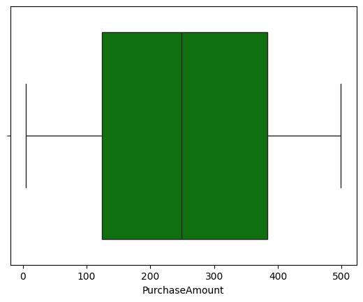
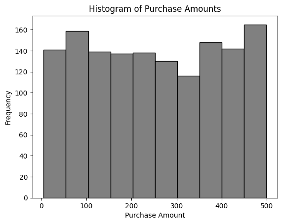
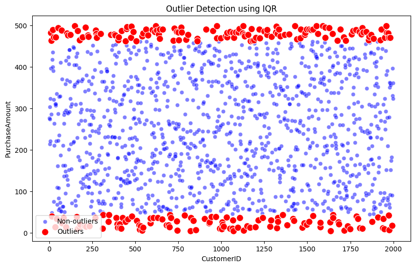
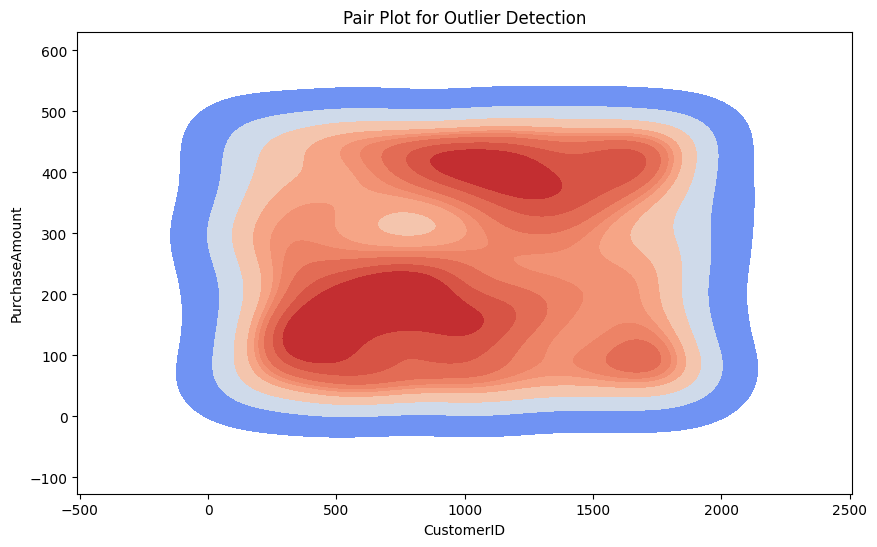
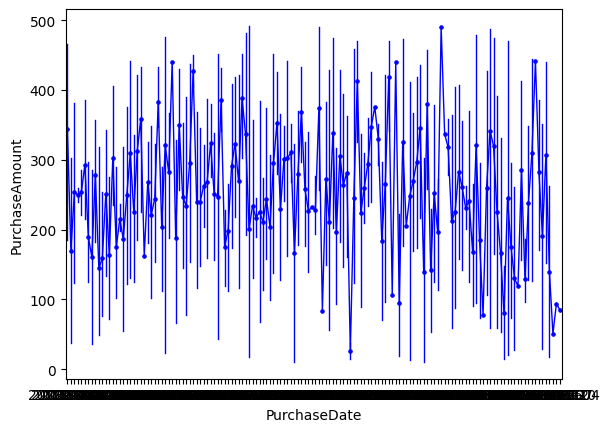

# Data Cleaning and EDA for Customer Purchases

## Overview
This project focuses on cleaning and exploring the dataset of customer purchases. The main objectives of the project are:
- To clean and preprocess the data for analysis
- Perform Exploratory Data Analysis (EDA)
- Detect outliers using multiple approaches

## Dataset
- `Customers_books_purchases.csv`: Contains customer data including purchase details.
- `Initial_Data.csv`: The raw data prior to cleaning and formatting.

## Key Features
1. **Data Cleaning**: 
   - Standardized phone numbers and removed duplicates.
   - Handled missing values and corrected data types.

2. **Exploratory Data Analysis (EDA)**:
   - **Distribution of Purchase Amount**: Analyzed using box plots and histograms.
   - **Outlier Detection**: Used IQR method to identify extreme values.
   - **Time Series Analysis**: Explored purchase trends over time.

### Visualizations

### 1. Box Plot of Purchase Amount

### 2. Histogram of Purchase Amounts

### 3. Outlier Detection Using IQR

### 4. Pair Plot for Outlier Detection

### 5. Time Series Plot of Purchase Amount

The time series plot tracks the purchase amounts over time, helping identify trends, spikes, and potential seasonal patterns.

## Key Findings
- The data contains several outliers, identified using IQR and pair plots.
- Purchases are distributed fairly evenly across different amounts, with no extreme skewness.
- Time series analysis revealed that there are some cyclical trends in the purchasing behavior.

## Next Steps
- **Advanced EDA**: Dive deeper into segmenting customers based on purchase behavior.
- **Machine Learning**: Build a predictive model to understand what factors influence higher purchases.

How to Use This Repository
1. Clone the Repository:
To get started, clone the repository using the following command in your terminal:

<<<<<<< HEAD
bash
Copy code
git clone https://github.com/gursimran8/Data-cleaning-and-VBA.git
2. Install Required Libraries:
After cloning the repository, ensure you have the necessary Python libraries installed. Run the following command to install them:

bash
Copy code
pip install pandas numpy matplotlib seaborn
3. Launch the Jupyter Notebook:
Once all libraries are installed, open the project in Jupyter Notebook by running:

bash
Copy code
jupyter notebook
This will open the Jupyter environment where you can explore the notebooks and perform data analysis.

Project Overview:
This project focuses on cleaning and analyzing data using Python. The notebooks provided will guide you through the data preprocessing steps, data visualization, and applying different cleaning techniques.

Author
Gursimran Singh
=======
### 1. Clone the repository:
git clone https://github.com/gursimran8/Data-cleaning-and-VBA.git

### 2. Install necessary libraries:
pip install pandas numpy matplotlib seaborn

### 3. Run the analysis notebooks and explore the data:
jupyter notebook #

### Author
**Gursimran Singh**
For any questions or contributions, feel free to reach out!

>>>>>>> b5693b8 (Improved How to use)

For any questions or contributions, feel free to reach out!

