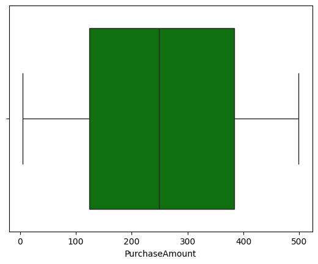
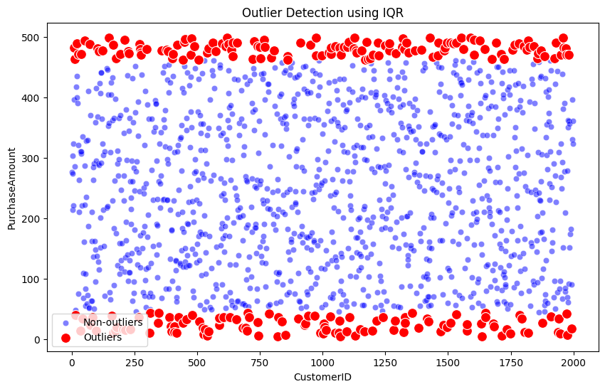
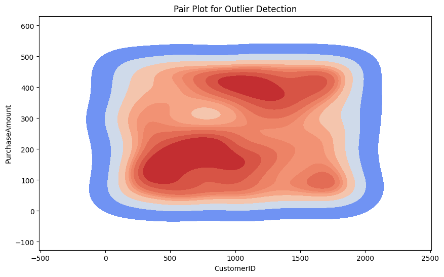

# Data Cleaning and EDA for Customer Purchases

## Overview
This project focuses on cleaning and exploring the dataset of customer purchases. The main objectives of the project are:
- To clean and preprocess the data for analysis
- Perform Exploratory Data Analysis (EDA)
- Detect outliers using multiple approaches

## Dataset
- `Customers_books_purchases.csv`: Contains customer data including purchase details.
- `Initial_Data.csv`: The raw data prior to cleaning and formatting.

## Key Features
1. **Data Cleaning**: 
   - Standardized phone numbers and removed duplicates.
   - Handled missing values and corrected data types.

2. **Exploratory Data Analysis (EDA)**:
   - **Distribution of Purchase Amount**: Analyzed using box plots and histograms.
   - **Outlier Detection**: Used IQR method to identify extreme values.
   - **Time Series Analysis**: Explored purchase trends over time.

## Visualizations

### 1. Box Plot of Purchase Amount


This box plot shows the distribution of purchase amounts, with the median, interquartile range (IQR), and potential outliers.

### 2. Histogram of Purchase Amounts


This histogram depicts the frequency distribution of the purchase amounts, giving a clear view of how the data is spread across different value ranges.

### 3. Outlier Detection Using IQR


This scatter plot visualizes the outliers in the data based on the IQR method. Points outside the whiskers are potential outliers.

### 4. Pair Plot for Outlier Detection


This contour plot helps in understanding the density and spread of purchase amounts across the customer dataset.

### 5. Time Series Plot of Purchase Amount


The time series plot tracks the purchase amounts over time, helping identify trends, spikes, and potential seasonal patterns.

## Key Findings
- The data contains several outliers, identified using IQR and pair plots.
- Purchases are distributed fairly evenly across different amounts, with no extreme skewness.
- Time series analysis revealed that there are some cyclical trends in the purchasing behavior.

## Next Steps
- **Advanced EDA**: Dive deeper into segmenting customers based on purchase behavior.
- **Machine Learning**: Build a predictive model to understand what factors influence higher purchases.

## How to Use

### 1. Clone the repository:
```bash
git clone https://github.com/gursimran8/Data-cleaning-and-VBA.git
### 2. Install necessary libraries:
pip install pandas numpy matplotlib seaborn
### 3. Run the analysis notebooks and explore the data:
jupyter notebook #

### Author
Gursimran Singh

